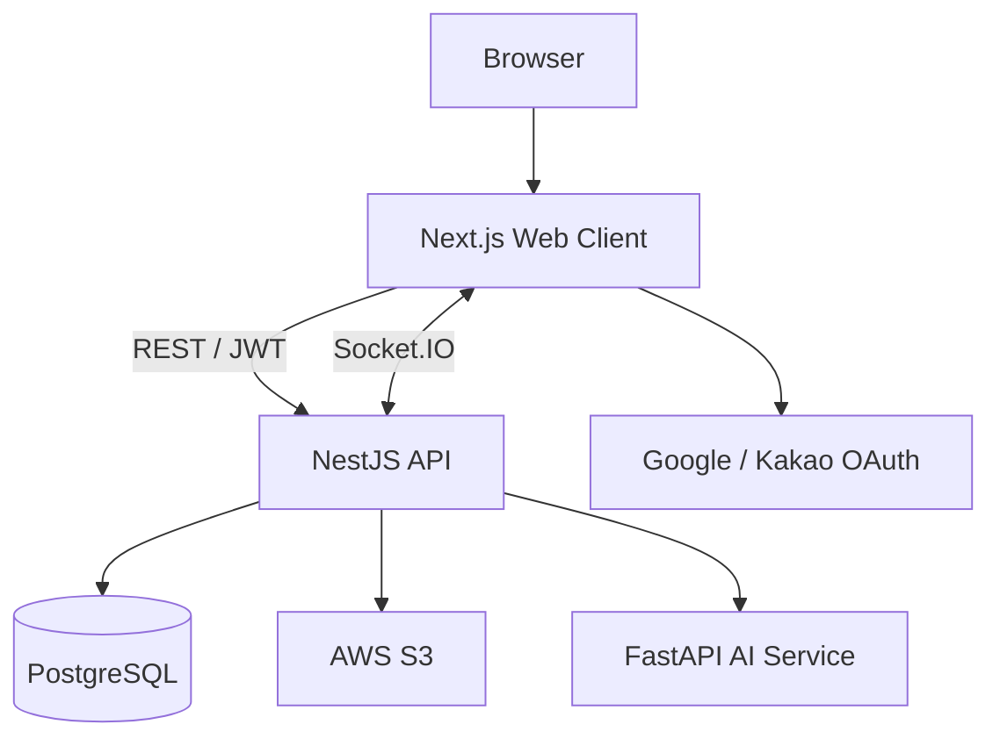

# Let Eat Go

> 食事をきっかけに、新しい人と新しい日常をつなぐソーシャルダイニングプラットフォーム

<p align="center">
  
</p>

<p align="center">
  
  
  
  
  
  
</p>

## About

Let Eat Goは、共通の関心を持つ人々が食事を通じて交流できるWebアプリケーションです。

ユーザーは地域・日程・参加条件からソーシャルダイニングを探し、自分でイベントを開催したり、既存のイベントに参加したりできます。参加前後のコミュニケーションまで一つのサービスで完結できるよう、リアルタイムチャット、レビュー、アルバム、プロフィール機能を統合しました。

本プロジェクトは4名で開発したチームプロジェクトです。フロントエンド、バックエンド、AIサービスを独立したリポジトリとして構成し、GitHub Issues・Pull Requests・Docker・GitHub Actionsを用いて開発とデプロイを行いました。

> **Project status:** 現在、公開デモ環境とローカル開発手順を再整備しています。ソースコードと主要機能は各リポジトリで確認できます。

## Key Features

| Feature | Description |
| --- | --- |
| ソーシャルダイニング検索 | 開催中のイベントを一覧・地図から検索し、地域や条件に合う食事会を発見 |
| イベント開催・参加 | 開催日時、場所、定員、年齢・性別条件、料金などを設定して募集・参加 |
| リアルタイムチャット | Socket.IOを利用したイベント参加者間のリアルタイムメッセージング |
| ソーシャルログイン | Google・Kakao OAuthとJWTによる認証・セッション管理 |
| マップ連携 | Kakao Maps上にイベントを表示し、位置情報から詳細を確認 |
| アルバム・コミュニティ | 画像投稿、コメント、いいねを通じて食事会の思い出を共有 |
| レビュー・プロフィール | 開催・参加履歴、レビュー、ユーザー情報を一元管理 |
| 多言語UI | 韓国語・日本語の表示切り替えに対応 |
| AIセーフティ | FastAPIとDistilBERTによる不適切表現の推論APIをバックエンドから利用 |

## Service Repositories

| Service | Responsibility | Repository |
| --- | --- | --- |
| Web Client | UI、状態管理、OAuth連携、地図、チャット、国際化 | **This repository** |
| Backend API | REST API、JWT認証、WebSocket、ドメインロジック、DB・S3連携 | [project-leteatgo-nestjs-repo](https://github.com/YJU-5/project-leteatgo-nestjs-repo) |
| AI Service | DistilBERTモデルのロード、テキスト分類、ヘルスチェックAPI | [ai-service](https://github.com/YJU-5/ai-service) |

## Architecture



- Frontend・BackendはDocker imageとしてビルドし、GitHub ActionsからAmazon ECR / ECSへデプロイする構成です。
- BackendはNestJSの機能単位のModuleとTypeORM Entityでドメインを分割しています。
- AI Serviceは起動時にS3から学習済みモデルを取得し、推論APIとしてBackendから利用されます。

## Tech Stack

| Layer | Technologies |
| --- | --- |
| Frontend | Next.js 15, React 18, TypeScript, Redux Toolkit, MUI, Chart.js, Socket.IO Client, Kakao Maps SDK |
| Backend | NestJS 11, TypeScript, TypeORM, PostgreSQL, Passport, JWT, Socket.IO, Swagger |
| AI | FastAPI, PyTorch, Transformers, DistilBERT, Pydantic |
| Infrastructure | Docker, AWS ECS, Amazon ECR, Amazon S3, GitHub Actions |
| Collaboration | GitHub Issues, Pull Requests, issue / PR templates, branch conventions |

## Frontend Structure

```text
app/          # App Router pages and route-level UI
components/   # Reusable UI components
contexts/     # Language context
hooks/        # Reusable React hooks
lib/          # Authentication and API utilities
locales/      # Korean and Japanese translations
public/       # Static assets
store/        # Global application state
```

## Getting Started

### Prerequisites

- Node.js 20+
- npm 10+
- Running [Let Eat Go Backend API](https://github.com/YJU-5/project-leteatgo-nestjs-repo)
- Google / Kakao developer credentials for OAuth and Kakao Maps

### Installation

```bash
git clone https://github.com/YJU-5/project-leteatgo-nextjs-repo.git
cd project-leteatgo-nextjs-repo
npm ci
```

Create `.env.local` in the project root:

```dotenv
NEXT_PUBLIC_API_URL=http://localhost:3001/api
NEXT_PUBLIC_ENV=development

NEXT_PUBLIC_KAKAO_CLIENT_ID=
NEXT_PUBLIC_KAKAO_REDIRECT_URI=http://localhost:3005/login/kakao
NEXT_PUBLIC_KAKAO_MAP_KEY=
NEXT_PUBLIC_KAKAO_REST_API_KEY=

NEXT_PUBLIC_GOOGLE_ID=
NEXT_PUBLIC_GOOGLE_REDIRECT_URI=http://localhost:3005/login/google
```

Start the development server:

```bash
npm run dev
```

Open [http://localhost:3005](http://localhost:3005).

### Available Commands

| Command | Purpose |
| --- | --- |
| `npm run dev` | Start the local development server on port 3005 |
| `npm run build` | Create a production build |
| `npm run start` | Start the production server |
| `npm run lint` | Run the configured lint command |

## Contribution Highlight — @lemonwasp

[@lemonwasp](https://github.com/lemonwasp) contributed across both the frontend and backend, including:

- アルバム機能のフロントエンド・バックエンド実装
- Kakao Mapsを利用した地図、マーカー、ツールチップ、詳細モーダルの実装
- ReduxとWeb Storageを利用した認証状態の復元・管理
- チャットルーム関連Entity・Relationの設計と修正
- Docker・Frontend build・デプロイ設定の整備
- Comment DTO、S3画像削除処理、Album API連携の不具合修正

See the full [frontend contribution history](https://github.com/YJU-5/project-leteatgo-nextjs-repo/commits/main/?author=lemonwasp) and [backend contribution history](https://github.com/YJU-5/project-leteatgo-nestjs-repo/commits/main/?author=lemonwasp).

## Team

- [chatmdgus](https://github.com/chatmdgus)
- [jinmo550](https://github.com/jinmo550)
- [KimHyeongSun445](https://github.com/KimHyeongSun445)
- [lemonwasp](https://github.com/lemonwasp)

## Roadmap

- [ ] 公開デモ環境の再構築
- [ ] `.env.example`の追加と設定手順の統一
- [ ] Frontend / Backend / AI Serviceのローカル起動をDocker Composeで統合
- [ ] Unit / E2E testとCI quality gateの拡充
- [ ] API・DB設計ドキュメントとスクリーンショットの追加

## License

This repository was created as an educational team project. No open-source license has been declared.
